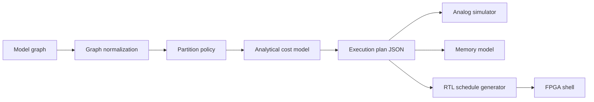

# Architecture

HeteroCore Compiler turns a framework-neutral JSON graph or ONNX model into
`heterocore.execution_plan.v1`. The plan is the contract between the five
HeteroCore repositories.

## Partitioning

The current policy maps `linear` and `matmul` operators when they:

1. exceed a configurable MAC threshold;
2. use no more than the configured weight precision; and
3. are not explicitly marked accuracy-sensitive.

This rule-based policy is deliberately reviewable. It is a baseline for later
search-based or learned partitioners, not a claim of optimal placement.

## Cost model

The cost model estimates cycles, compute energy, peripheral energy, memory
traffic, and interconnect energy from explicit hardware parameters. Analog
weights are treated as resident in the crossbar, so mapped operations avoid
weight reads in the traffic estimate. Analog operations are charged separately
for DAC conversions, ADC conversions, partial-sum accumulation, array control,
and calibration.

All generated values are analytical projections. The schema carries
`claim_scope.measured_hardware=false` so downstream dashboards cannot silently
present them as lab measurements.
