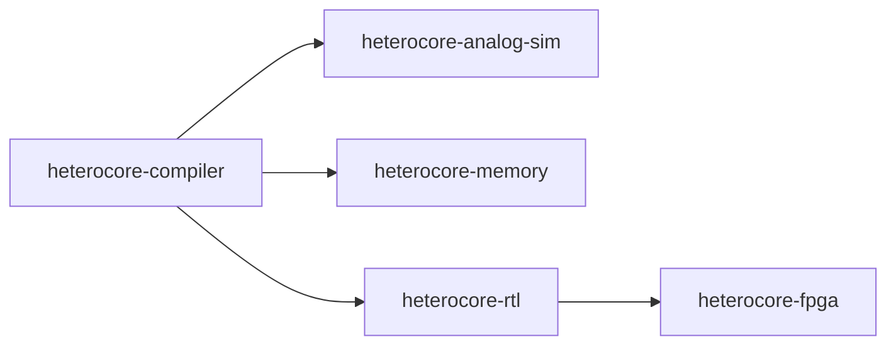

# HeteroCore Compiler

[](https://github.com/WaffleBits/heterocore-compiler/actions/workflows/ci.yml)

Compiler and analytical cost model for mixed analog-digital AI inference. It
partitions a model graph, explains every placement decision, and emits the
versioned execution plan consumed by the other HeteroCore repositories.

> Status: architecture simulation and digital implementation prototype. All
> performance and energy values are projections, not measured silicon results.

## System Context



## What It Demonstrates

- Framework-neutral operator graph ingestion.
- Explainable analog-versus-digital partitioning.
- Configurable array, digital MAC, clock, and energy assumptions.
- Per-operator cycle, energy, and memory-traffic estimates.
- A JSON Schema-backed cross-repository execution plan.
- Automated tests and a reproducible sample workload.

## Checked-In Evidence

`results/tiny_transformer.plan.json` is generated from the sample transformer
block with default hardware assumptions:

| Metric | Result |
| --- | ---: |
| operators | 11 |
| analog-mapped operators | 6 |
| analog MAC fraction | 96.0% |
| projected energy reduction vs. all-digital model | 84.87% |
| projected memory-traffic reduction | 15.79% |

These are analytical cost-model outputs. The input, assumptions, placement
reasons, and per-operator estimates are all present in the result file.

## Quick Start

```bash
python -m venv .venv
source .venv/bin/activate
pip install -e .
heterocore-compile examples/tiny_transformer.json \
  -o results/tiny_transformer.plan.json
```

On PowerShell, activate with `.venv\Scripts\Activate.ps1`.

The command prints the analog MAC fraction and projected energy reduction. The
full assumptions and per-operator decisions are saved in the output plan.

## Input Format

The minimal graph format is intentionally small:

```json
{
  "model": {"name": "example"},
  "operators": [
    {
      "id": "projection",
      "type": "linear",
      "dimensions": {"m": 128, "k": 256, "n": 256},
      "weight_bits": 4
    }
  ]
}
```

An ONNX or PyTorch adapter can normalize into this representation without
changing downstream tools.

## Reproduce the Evidence

```bash
python -m unittest discover -s tests
heterocore-compile examples/tiny_transformer.json \
  -o results/tiny_transformer.plan.json
```

See [ARCHITECTURE.md](ARCHITECTURE.md) for partitioning and cost-model details.
See [docs/INTEGRATION.md](docs/INTEGRATION.md) for the five-repository workflow.

## Claim Boundaries

This project can test compiler behavior and compare architecture assumptions.
It does not establish fabrication yield, physical analog noise, thermal
behavior, ADC/DAC energy, or real tokens per watt.
